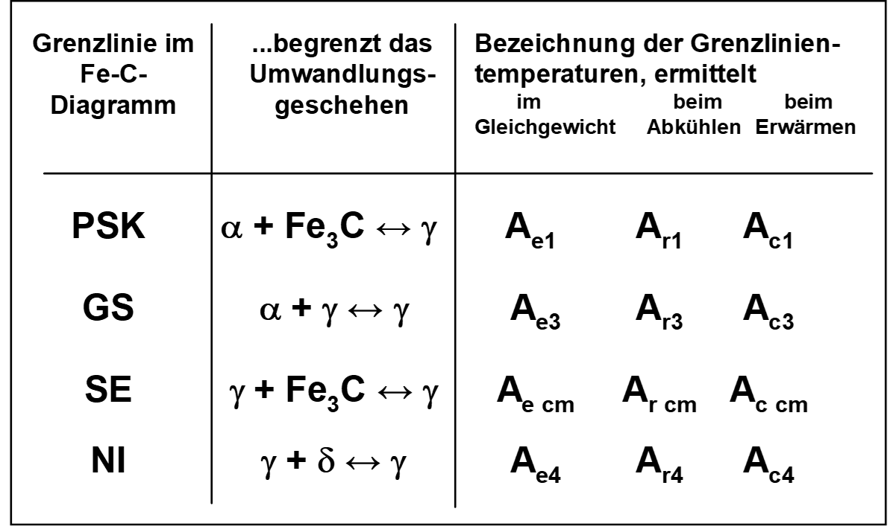
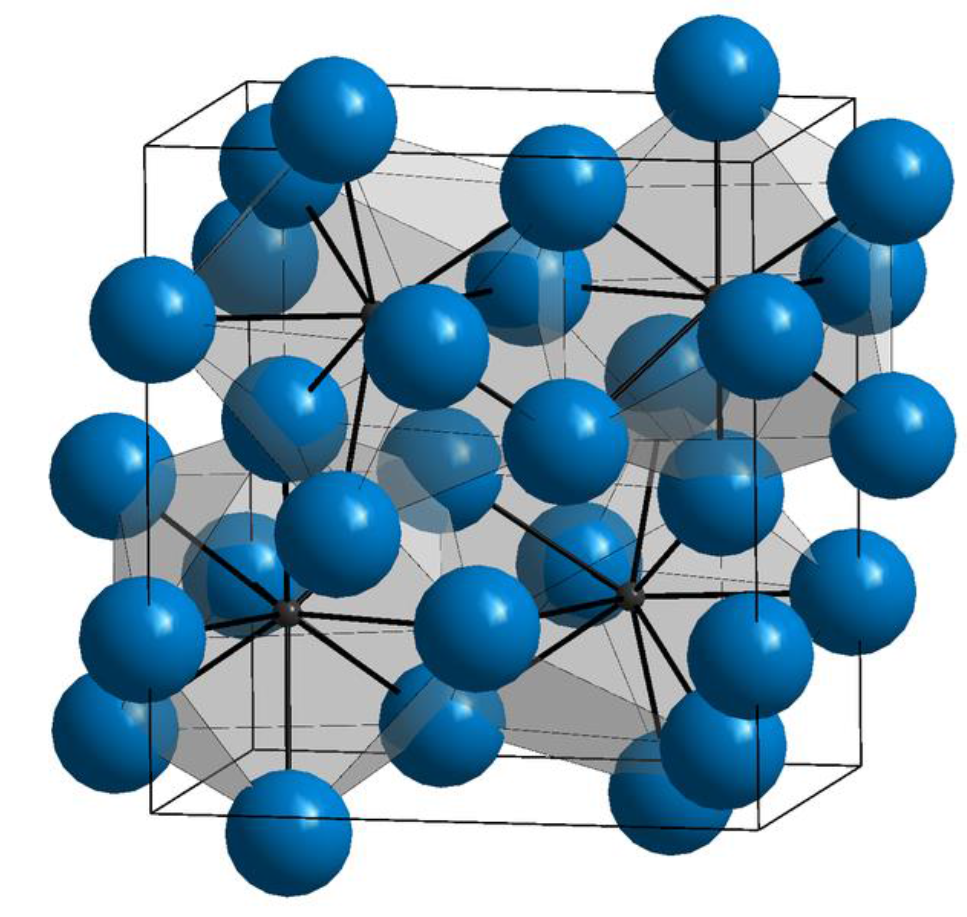
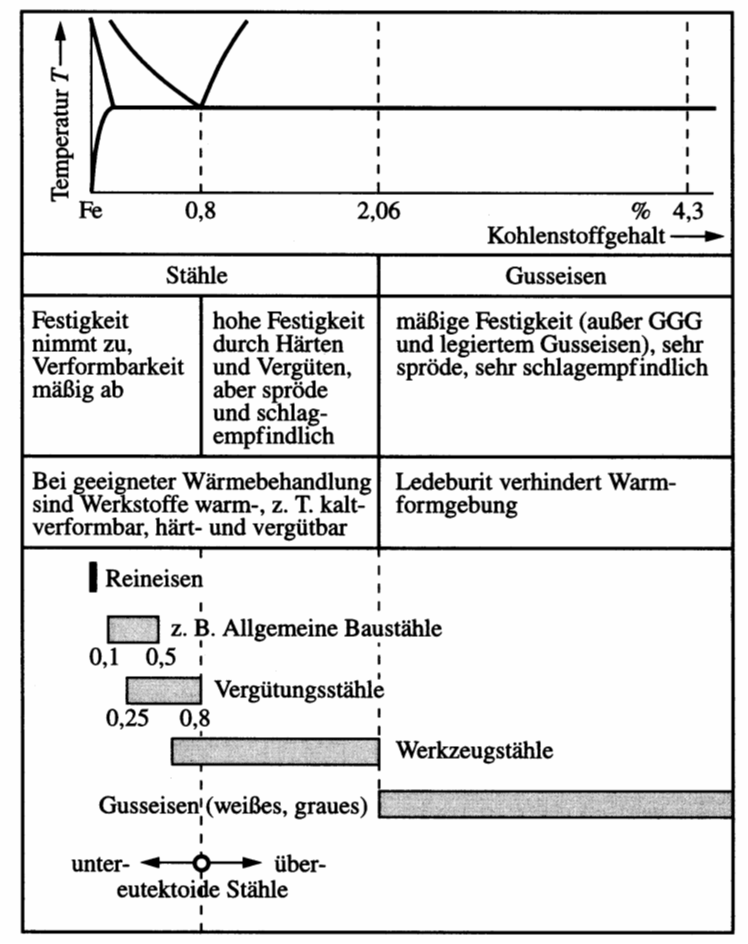

# Eisen
Wichtigster Werkstoff im Maschinenbau. Gründe sind
- geringe Kosten
- hohe Festigkeit und elastische Steifigkeit
- Vielzahl von möglichen Legierungen
- Verfügbarkeit
- je nach Legierung Gießbarkeit, Schweißbarkeit, etc.

| Kohlenstoffgehalt (Masse-%) | Bezeichnung               | Typ                                  |
|-----------------------------|---------------------------|--------------------------------------|
| 0.02 < C < 0.8              | (Kohlenstoff-) Stahl       | untereutektoide Stähle               |
| C = 0.8                     | (Kohlenstoff-) Stahl       | eutektoide Stähle                    |
| 0.8 < C < 2.06              | (Kohlenstoff-) Stahl       | übereutektoide Stähle                |
| 2.06 < C < 4.3              | Gusseisen                 | untereutektische Gusseisen           |
| C = 4.3                     | Gusseisen                 | eutektische Gusseisen                |
| 4.3 < C < 6.67              | Gusseisen                 | übereutektische Gusseisen            |

---

# Eisen Kohlenstoff Diagramm (EKD)

- wichtigstes ZSD
- Eisenist der wichtigste Werkstoff im Maschinenbau. 

Gründe sind
- geringe Kosten
- hohe Festigkeit und elastische Steifigkeit
- Vielzahl von möglichen Legierungen
- Verfügbarkeit
- Gießbarkeit, Schweißbarkeit, etc.

[Erklärvideo für das Eisen Kohlenstoff Diagramm](https://www.youtube.com/watch?v=oJqvnKhnsg0&t=1s)

---

---

---
## Wichtige Gleichgewichtslinien

ABCD 	Liquiduslinie			
AHIECF 	Soliduslinie			
ECF 		Eutektikale			
PSK 		Eutektoide			
ES, PQ		Sättigungslinien				MOSK		Curie-Linie
QPSECD 	Bildung/Auflösung Fe3C	

## Punkte im Zustandsdiagramm
S - eutektoider Punkt
C - eutektischer Punkt
G -	$\alpha$ / $\gamma$ - Umwandlungspunkt des reinen Eisens
E -	Punkt max. C-Löslichkeit im $\alpha$ - MK
P - Punkt max. C-Löslichkeit im $\gamma$ - MK
u. a. m. (vgl. Fe-Fe3C - Diagramm)

Folgende Grenzlinientemperaturen (Umwandlungstemperaturen) werden benutzt: 

A: 	arreter (anhalten)
r:	refroidir (abkühlen)
c:	chauffer (erwärmen)
e:	équilibre (Gleichgewicht)

Ac1: 723°C
Ac3: abhängig vom C-Gehalt

# Phasen- und Gefüge im System-Eisen-Kohlenstoff
# Mischkristalle

## $\alpha$-Mischkristall (krz)
- Gefügebezeichnung Ferrit ($\alpha$-Ferrit)
- rein ferritisches Gefüge besitzt geringe Härte/Festigkeit, aber hohe Duktilität (Zähigkeit)
- Max. C-Löslichkeit: nur 0,02 % 

## $\delta$-Mischkristall (krz)
 - $\delta$-Ferrit ist nur oberhalb von 1392°C stabil  
 - technisch von untergeordneter Bedeutung
 - Max. C-Löslichkeit: 0.12 %

## $\gamma$-Mischkristall (kfz)
- Gefügebezeichnung Austenit
- scheidet sich oberhalb der G-S-E-Linie  aus; 
  - durch Legierungszusätze (Ni, Mn) und Abschrecken auch bei Raumtemperatur beständig (austenitische Stähle)
- unmagnetisch, zäh und durch Kaltverfestigung härtbar (Mangan-, Nickel-, Chrom-Nickel-Stähle)
- hohe Warmfestigkeit, gute Korrosions- und Zunderbeständigkeit
- Max. C-Löslichkeit: 2.06 %

## Intermediäre Phase
Zementit (Eisencarbid Fe3C); 6.67 Masse-% C-Gehalt

- Primärzementit:	
primäre Kristallisation aus der Schmelze (Linie CD)

- Sekundärzementit: 
Ausscheidung aus dem Austenit (Linie ES)

- Tertiärzementit:	
Ausscheidung aus dem Ferrit (Linie PQ)

## Kristallstruktur

- orthorhombischen Elementarzelle 
  -  zwölf Eisen- und vier Kohlenstoffatome
  - die Kohlenstoffatome sind relativ unregelmäßig (zweifach überkappt trigonal-prismatisch) von acht Eisenatomen umgeben

- Zementit ist hart und spröde
- überwiegende Zahl der technischen Eisen-Kohlenstoff-Legierungen erstarrt unter Bildung von Zementit

---

---

Weiterhin wird unterschieden zwischen dem schwarzen Gusseisen (Grauguss), in dem der überschüssige Kohlenstoff in Form von Graphit, und dem weißen Gusseisen, in dem der Kohlenstoff in Form von Zementit vorkommt. 

# Stahl

[Normen](https://moodle2.hs-magdeburg.de/moodle/mod/resource/view.php?id=332129)

- Mit zunehmendem C-Gehalt steigen die Festigkeit und Härtbarkeit des Stahles, wogegen seine Dehnung, Schmiedbarkeit, Schweißbarkeit und Bearbeitbarkeit (durch spanabhebende Werkzeuge) verringert werden
- Der Korrosionswiderstand gegenüber Wasser, Säuren und heißen Gasen wird durch den Kohlenstoff praktisch nicht beeinflusst. 
- Für Kohlenstoffgehalte unter 0.25 Masse-% sind Stähle gut schweißbar

# Gusseisen

- Massenanteil über 2.06 % Kohlenstoff
- gute Gießbarkeit auf (geringer Schmelzpunkt, dünnflüssige Schmelze, …)
- hart und spröde ist
- Die Zerspanbarkeit von Gusseisen hängt von der genauen Sorte ab; 
  - bei Gusseisen mit Lamellengraphit – der häufigsten Sorte – ist sie gut
  - Festigkeit ist geringer als die von Stahlguss, die Dämpfung ist höher
- Viele Sorten enthalten zusätzlich noch Silicium, das die Gießbarkeit verbessert, sowie weitere Legierungsanteile wie Mangan, Chrom oder Nickel
---

---

Es wird unterschieden zwischen:

- grauem Gusseisen (Grauguss), in dem der Kohlenstoff in Form von Graphit vorkommt. _Die Bruchflächen erscheinen grau_
- weißem Gusseisen, in dem der Kohlenstoff als Carbid in Form von Zementit (Fe3C) vorkommt. _Die Bruchflächen sind weiß_

---

## Vergleich Gusseisen und Stahl 

[Qualitativ zum Lesen](https://capablemachining.com/de/Blog/Stahl-vs.-Gusseisen-ein-umfassender-Vergleich/)

- Dichte $7.2\frac{g}{cm^3}$ vs. $7.85\frac{g}{cm^3}$ 
- Schmelztemperatur $1150 °C$
- korrosionsbeständiger als Stahl
- spröder als Stahl

[Quantitativ](https://www.schweizer-fn.de/festigkeit/festigkeitswerte/guss/stahlguss_start.php)

---

---

# Einteilung und Eigenschaften

---

## Gusseisen mit Lamellengraphit

- einfachste und häufigste Gusseisen-Sorte ist Gusseisen mit Lamellengraphit 

- Graphit liegt in Form von dünnen, unregelmäßig geformten Lamellen vor

---

## Gusseisen mit Lamellengraphit

-  Lamellen wirken bei Zugbelastung als Kerben, daher ist die Zugfestigkeit infolge der Kerbwirkung relativ gering
-  Druckfestigkeit liegt etwa um den Faktor 4 höher als die Zugfestigkeit

---

- spröder Werkstoff
- gute Wärmeleitfähigkeit
-  vorteilhafte Selbstschmiereigenschaften
  - wenn durch Bearbeitung die Lamellen angeschnitten und der Graphit selbst oder an dessen Stelle andere Schmiermittel in den Hohlräumen „bevorratet“ werden können. 

---

## Gusseisen mit Kugelgraphit

- Bessere mechanische Eigenschaften als Gusseisen mit Lamellengraphit
- zeigt duktiles Verhalten 

---

## Gusseisen mit [Vermiculargraphit](https://www.giessereilexikon.com/giesserei-lexikon/Encyclopedia/show/gusseisen-mit-vermiculargrafit-190/?cHash=57ba0f0209983c2de8ccc8e299b07616)

- Eigenschaften zwischen Gusseisen mit Lamellengraphit und denen des Gusseisens mit Kugelgraphit
-  Herstellung ist jedoch schwieriger und erfordert eine in engen Toleranzen geführte Schmelzbehandlung

---

- höhere Festigkeit und Bruchdehnung und Bruchzähigkeit
- geringere Wanddickenabhängigkeit der Eigenschaften
Gusseisen mit Vermiculargrafit zeichnet sich gegenüber Gusseisen mit Lamellengrafit durch folgende Eigenschaften aus:

- höhere Festigkeit und Bruchdehnung
- höhere Bruchzähigkeit
- geringere Wanddickenabhängigkeit der Eigenschaften

---

Gegenüber Gusseisen mit Kugelgrafit bietet Gusseisen mit Vermiculargrafit folgende Vorteile:

- niedrigerer thermischer Ausdehnungskoeffizient
- höhere Wärmeleitfähigkeit
- niedrigerer E-Modul
- geringeres thermisch induziertes Eigenspannungsniveau
- bessere Temperaturwechselbeständigkeit und geringere Verzugsneigung aufgrund der zuvor genannten Eigenschaften
- besseres Dämpfungsvermögen
- bessere gießtechnische Eigenschaften (geringere Lunkerneigung, besseres Formfüllungs- und Fließvermögen)

