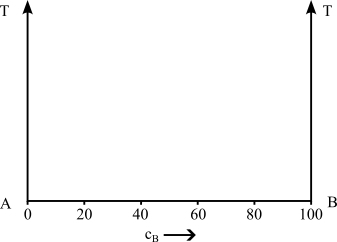

# Zustandsdiagramme (ZSD)
https://studyflix.de/chemie/eisen-kohlenstoff-diagramm-1539

- auch Phasendiagramm -phase diagram-
- stellt den Zustand von Legierungen und Stoffgemischen in Abhängigkeit von der chemischen Zusammensetzung, Temperatur und ggf. dem Druck dar
- Zustand meint die auftretenden Phasen (alle festen, flüssige, gasförmige)

---
## Achtung!

Zustandsdiagramme sind Gleichgewichtsdiagramme. Sie haben nur Gültigkeit bei einer sehr lang-samen Abkühlung aus dem schmelzflüssigen Zustand bis hin zur Raumtemperatur, bei der sich das Gleichgewicht zwischen den Phasen (an bzw. zwischen den Phasengrenzlinien) einstellen kann. 

---

---

## Löslichkeiten

_Unlöslich_
- zu große Unterschiede bei den Atomdurchmessern
- Kristallgitter weichen voneinander ab
- Komponenten sind chemisch sehr unterschiedlich

_Begrenzt löslich_
- zwischen unlöslich und löslich
- Teile der Kompenten können sich ineinander lösen
- es entstehen Kristallgemische aus Mischkristallen

_Löslich_
- kaum Unterschiede bei den Atomdurchmessern
- Kristallgitter sind identisch
- Komponenten sind chemisch sehr nah beieinander

---

- Die Phasen bzw. Phasengrenzlinien können als ein Zustandsdiagramm dargestellt werden
- Die Anzahl der miteinander im Gleichgewicht stehenden Phasen ist gesetzmäßig verknüpft mit der Zahl der an der Legierungsbildung beteiligten Komponenten und der Zahl der Freiheitsgrade über die Gibbsche Phasenregel
- Ein Freiheitsgrad beinhaltet die mögliche Veränderung von Zustandsvariablen, ohne das Gleichgewicht, d.h. die Anzahl der Phasen, zu ändern
- Die Anzahl der frei wählbaren Zustandsvariablen wird  nach der Phasenregel bestimmt

---

## Gibbsche Phasenregel

$F = n  - P + 2$
(für Gase und Flüssigkeiten)
F = Anzahl der Freiheitsgrade; n = Anzahl der Komponenten; P = Anzahl der Phasen

bei konstantem Druck (feste Stoffe) 	
				
$F = n  - P + 1$
				
Damit ergibt sich für die Anwendung dieser Gesetzmäßigkeiten bei der Abkühlungs- und Erwär-mungskurve für metallische Systeme

F = 0		ein Haltepunkt und
F = 1		ein Knickpunkt.

F beschreibt die möglichen Bewegungsrichtungen, damit sich an dem Zustand nichts ändern (in kleinem Maße).

Beispiel: innerhalb einer Phasenfläche ist F=2. D.h. ich kann mich in 2 Dimensionen bewegen. An der Phasengrenzlinie ist F=1. Ich kann mich auf dieser Linie bewegen.

---

# Binäre Systeme
## Unlöslichkeit

---
## Vollständige Löslichkeit

---

---

## Hebelgesetz

- In Punkt 2 hat die Schmelze einen kleineren Nickelgehalt als der $\alpha$-MK
- D.h. die Konzentration im Mischkristall muss steigen, damit die Zahl der Nickelatome plastischer

!!! info "Zusammensetzung" Schmelze und Mischkristall müssen nicht die gleiche chemische Zusammensetzung haben

$\frac{m_s}{m_{\alpha}}=\frac{c_{\alpha}-c_{L}}{c_{L}-c_{S}}$

---
## Rechenbeispiel

-> Annahme Konzentrationen in Punkt 2

$c_S=20\%$, $c_{\alpha}=40\%$, $c_L=25\%$

---
## Lösung

$\frac{m_s}{m_{\alpha}}={c_{\alpha}-c_{L}}{c_{L}-c_{S}}=\frac{40\%-25\%}{25\%-20\%}=\frac{15}{5}=\frac{3}{1}$
- im Punkt 2 liegt 3 mal soviel Schmelze wie Mischkristall vor

## Eutektischer Entmischung

- Komponenten sind **löslich** im flüssigen Zustand
- Komponenten sind **unlöslich** im festen Zustand

## Eutektische Reaktion

-  bei einer Konzentration erstarren aus der Schmelze S bei konstanter Temperatur (Eutektikale) A- und B-Kristalle zu einem feinkristallinen Kristallgemisch (Eutektikum)
- eutektische Gefüge besitzt oft eine schicht- oder lamellenartige Struktur
- Legierungen anderer Konzentrationen scheiden vor Erreichen der Eutektikale (Haltepunkt bei der Eutektischen Reaktion) die überwiegende Komponente aus (A- oder B-Kristalle), so dass sich die Konzentration der verbleibenden Schmelze der eutektischen Zusammensetzung annähert. 
- die Eutektikale bildet die Soliduslinie des gesamten Systems

---

## System mit Mischungslücken
- Komponenten sind **löslich** im flüssigen Zustand
- Komponenten sind **begrenzt löslich** im festen Zustand

_Löslichkeits- oder Sättigungslinien_
- Linien, die die Einphasengebiete ($\alpha$, $\beta$) von dem Gebiet der Kristallgemische aus Mischkristallen ($\alpha+\beta$) abgrenzen
Sonderfall:
- ein System von Mischkristallen bilden Einlagerungsmischkristalle 
- Die Konzentrationsachse endet dann mit der Konzentration der Sättigung der Komponente B im Gitter der Komponente A
- Das Einphasengebiet der Komponente B kann dann nicht existieren.

## Systeme mit Peritektikum (mit peritektischer Entmischung) 

-  weit auseinander liegende Schmelz-/Erstarrungstemperaturen der beteiligten Komponenten sind charakteristisch.
- Bei Abkühlung aus der Schmelze bildet sich ein Mischkristall $\alpha$
- bildet bei konstanter Temperatur (entsprechend der **Eutektikalen**) mit der Schmelze reagierend eine zweite Mischkristallart $\beta$ bildet. 
- bei einer peritektischen Reak-tion entstehen aus der Schmelze und bereits ausgeschiedenen $\alpha$-Mischkristallen bei gleich bleibender Temperatur neue $\beta$-Mischkristalle.

---

## Realdiagramme
- die bisherigen Digramme waren Idealdigramme und treten so nicht wirklich auf
- Eisen-Kohlenstoff-Diagramm (EKD) ist das wichtigste Realdiagramm
- Grundmetall ist Eisen -> Stahl oder Eisenguss
- das EKD setzt sich aus den Idealdiagrammen - dem peritektischen, eutektischen und eutektoiden Teildiagramm - zusammen

---

- Man kann je nach Erscheinungsform des Kohlenstoffs zwischen dem stabilen System Fe-C, in dem Kohlenstoff als Graphit, und dem metastabilen System Fe-Fe3C, in dem Kohlenstoff gebunden als Fe3C (intermediäre Phase Zementit) vorliegt, unterscheiden. 
- Stabil bedeutet, dass der Kohlenstoff in Form von Graphit nicht weiter zerlegt werden kann, Fe3C aber bei langzeitigem Glühen in Eisen und Temperkohle zerfällt. 
- Das metastabile Sys-tem stellt gewissermaßen ein relatives Minimum der Gesamtenergie des Systems dar. Für techni-sche Belange kann es als „hinreichend stabil“ bewertet werden.

---
