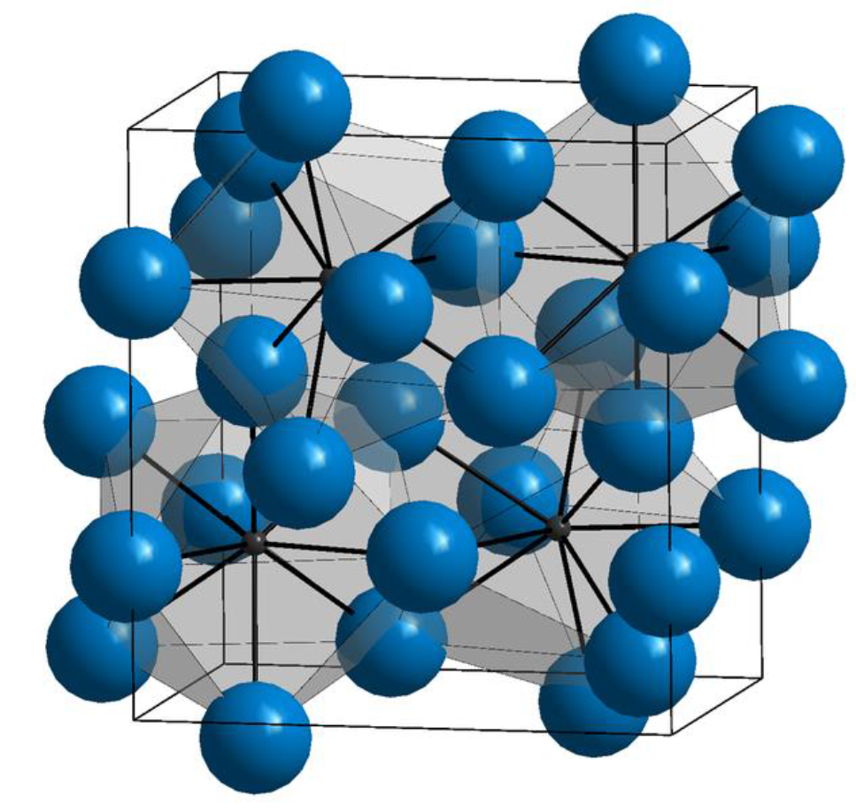
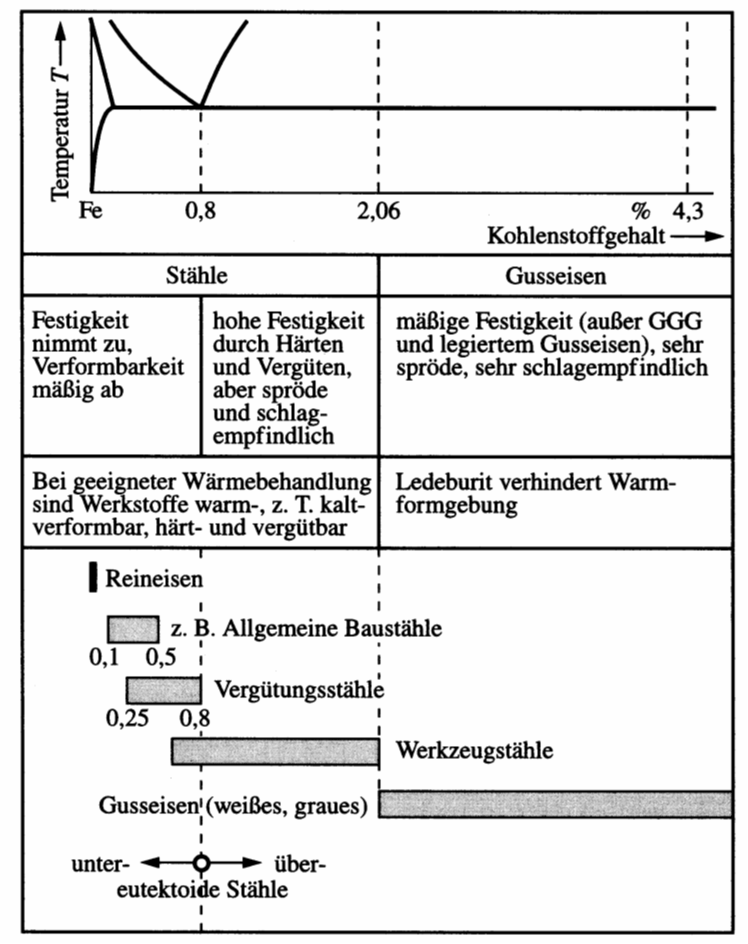

# Zustandsdiagramme
https://studyflix.de/chemie/eisen-kohlenstoff-diagramm-1539

# Zustandsdiagramme

- auch Phasendiagramm -phase diagram-
- stellt den Zustand von Legierungen und Stoffgemischen in Abhängigkeit von der chemischen Zusammensetzung, Temperatur und ggf. dem Druck dar
- Zustand meint die auftretenden Phasen (alle festen, flüssige, gasförmige)

---
## Achtung!

Zustandsdiagramme sind Gleichgewichtsdiagramme. Sie haben nur Gültigkeit bei einer sehr lang-samen Abkühlung aus dem schmelzflüssigen Zustand bis hin zur Raumtemperatur, bei der sich das Gleichgewicht zwischen den Phasen (an bzw. zwischen den Phasengrenzlinien) einstellen kann. 

---

---

## Löslichkeiten

Unlöslich

- zu große Unterschiede bei den Atomdurchmessern
- Kristallgitter weichen voneinander ab
- Komponenten sind chemisch sehr unterschiedlich

Löslich

- kaum Unterschiede bei den Atomdurchmessern
- Kristallgitter sind identisch
- Komponenten sind chemisch sehr nah beieinander

---

# Zustandsdiagramme (ZSD)

---

- Die Phasen bzw. Phasengrenzlinien können als ein Zustandsdiagramm dargestellt werden
- Die Anzahl der miteinander im Gleichgewicht stehenden Phasen ist gesetzmäßig verknüpft mit der Zahl der an der Legierungsbildung beteiligten Komponenten und der Zahl der Freiheitsgrade über die Gibbsche Phasenregel
- Ein Freiheitsgrad beinhaltet die mögliche Veränderung von Zustandsvariablen, ohne das Gleichgewicht, d.h. die Anzahl der Phasen, zu ändern
- Die Anzahl der frei wählbaren Zustandsvariablen wird  nach der Phasenregel bestimmt

---

## Gibbsche Phasenregel

$F = n  - P + 2$
(für Gase und Flüssigkeiten)
F = Anzahl der Freiheitsgrade; n = Anzahl der Komponenten; P = Anzahl der Phasen

bei konstantem Druck (feste Stoffe) 	
				
$F = n  - P + 1$
				
Damit ergibt sich für die Anwendung dieser Gesetzmäßigkeiten bei der Abkühlungs- und Erwär-mungskurve für metallische Systeme

F = 0		ein Haltepunkt und
F = 1		ein Knickpunkt.

---

---

---

---

## Eutektischer Entmischung

- Komponenten sind **löslich** im flüssigen Zustand
- Komponenten sind **unlöslich** im festen Zustand

## Eutektische Reaktion

-  bei einer Konzentration erstarren aus der Schmelze S bei konstanter Temperatur (Eutektikale) A- und B-Kristalle zu einem feinkristallinen Kristallgemisch (Eutektikum)
- eutektische Gefüge besitzt oft eine schicht- oder lamellenartige Struktur
- Legierungen anderer Konzentrationen scheiden vor Erreichen der Eutektikale (Haltepunkt bei der Eutektischen Reaktion) die überwiegende Komponente aus (A- oder B-Kristalle), so dass sich die Konzentration der verbleibenden Schmelze der eutektischen Zusammensetzung annähert. 
- die Eutektikale bildet die Soliduslinie des gesamten Systems

---

## System mit Mischungslücken
- Komponenten sind **löslich** im flüssigen Zustand
- Komponenten sind **begrenzt löslich** im festen Zustand

_Löslichkeits- oder Sättigungslinien_
- Linien, die die Einphasengebiete ($\alpha$, $\beta$) von dem Gebiet der Kristallgemische aus Mischkristallen ($\alpha+\beta$) abgrenzen
Sonderfall:
- ein System von Mischkristallen bilden Einlagerungsmischkristalle 
- Die Konzentrationsachse endet dann mit der Konzentration der Sättigung der Komponente B im Gitter der Komponente A
- Das Einphasengebiet der Komponente B kann dann nicht existieren.

## Systeme mit Peritektikum (mit peritektischer Entmischung) 

-  weit auseinander liegende Schmelz-/Erstarrungstemperaturen der beteiligten Komponenten sind charakteristisch.
- Bei Abkühlung aus der Schmelze bildet sich ein Mischkristall $\alpha$
- bildet bei konstanter Temperatur (entsprechend der **Eutektikalen**) mit der Schmelze reagierend eine zweite Mischkristallart $\beta$ bildet. 
- bei einer peritektischen Reak-tion entstehen aus der Schmelze und bereits ausgeschiedenen $\alpha$-Mischkristallen bei gleich bleibender Temperatur neue $\beta$-Mischkristalle.

---

## Realdiagramme
- die bisherigen Digramme waren Idealdigramme und treten so nicht wirklich auf
- Eisen-Kohlenstoff-Diagramm (EKD) ist das wichtigste Realdiagramm
- Grundmetall ist Eisen -> Stahl oder Eisenguss
- das EKD setzt sich aus den Idealdiagrammen - dem peritektischen, eutektischen und eutektoiden Teildiagramm - zusammen

---

- Man kann je nach Erscheinungsform des Kohlenstoffs zwischen dem stabilen System Fe-C, in dem Kohlenstoff als Graphit, und dem metastabilen System Fe-Fe3C, in dem Kohlenstoff gebunden als Fe3C (intermediäre Phase Zementit) vorliegt, unterscheiden. 
- Stabil bedeutet, dass der Kohlenstoff in Form von Graphit nicht weiter zerlegt werden kann, Fe3C aber bei langzeitigem Glühen in Eisen und Temperkohle zerfällt. 
- Das metastabile Sys-tem stellt gewissermaßen ein relatives Minimum der Gesamtenergie des Systems dar. Für techni-sche Belange kann es als „hinreichend stabil“ bewertet werden.

---

# Eisen-Kohlenstoffdiagramm (EKD)

- wichtigstes ZSD
- Eisenist der wichtigste Werkstoff im Maschinenbau. 

Gründe sind
- geringe Kosten
- hohe Festigkeit und elastische Steifigkeit
- Vielzahl von möglichen Legierungen
- Verfügbarkeit
- Gießbarkeit, Schweißbarkeit, etc.

[Erklärvideo für das Eisen Kohlenstoff Diagramm](https://www.youtube.com/watch?v=oJqvnKhnsg0&t=1s)

---

---

---
## Wichtige Gleichgewichtslinien

ABCD 	Liquiduslinie			
AHIECF 	Soliduslinie			
ECF 		Eutektikale			
PSK 		Eutektoide			
ES, PQ		Sättigungslinien				MOSK		Curie-Linie
QPSECD 	Bildung/Auflösung Fe3C	

## Punkte im Zustandsdiagramm
S - eutektoider Punkt
C - eutektischer Punkt
G -	$\alpha$ / $\gamma$ - Umwandlungspunkt des reinen Eisens
E -	Punkt max. C-Löslichkeit im $\alpha$ - MK
P - Punkt max. C-Löslichkeit im $\gamma$ - MK
u. a. m. (vgl. Fe-Fe3C - Diagramm)

Folgende Grenzlinientemperaturen (Umwandlungstemperaturen) werden benutzt: 

A: 	arreter (anhalten)
r:	refroidir (abkühlen)
c:	chauffer (erwärmen)
e:	équilibre (Gleichgewicht)

Ac1: 723°C
Ac3: abhängig vom C-Gehalt

# Phasen- und Gefüge im System-Eisen-Kohlenstoff
# Mischkristalle

## $\alpha$-Mischkristall (krz)
- Gefügebezeichnung Ferrit ($\alpha$-Ferrit)
- rein ferritisches Gefüge besitzt geringe Härte/Festigkeit, aber hohe Duktilität (Zähigkeit)
- Max. C-Löslichkeit: nur 0,02 % 

## Exkurs Härte / Festigkeit
Im Detail kommt das später.
Festigkeit 
- Maß der maximalen Beanspruchbarkeit bis Versagen
- Kraft pro Querschnittsfläche

Härte 
- mechanischer Widerstand gegen mechanisches Eindringung eines anderen Körpers 
- Maß für die Verschleißbeständigkeit

## $\delta$-Mischkristall (krz)
 - $\delta$-Ferrit ist nur oberhalb von 1392°C stabil  
 - technisch von untergeordneter Bedeutung
 - Max. C-Löslichkeit: 0.12 %

## $\gamma$-Mischkristall (kfz)
- Gefügebezeichnung Austenit
- scheidet sich oberhalb der G-S-E-Linie  aus; 
  - durch Legierungszusätze (Ni, Mn) und Abschrecken auch bei Raumtemperatur beständig (austenitische Stähle)
- unmagnetisch, zäh und durch Kaltverfestigung härtbar (Mangan-, Nickel-, Chrom-Nickel-Stähle)
- hohe Warmfestigkeit, gute Korrosions- und Zunderbeständigkeit
- Max. C-Löslichkeit: 2.06 %

## Intermediäre Phase
Zementit (Eisencarbid Fe3C); 6.67 Masse-% C-Gehalt

- Primärzementit:	
primäre Kristallisation aus der Schmelze (Linie CD)

- Sekundärzementit: 
Ausscheidung aus dem Austenit (Linie ES)

- Tertiärzementit:	
Ausscheidung aus dem Ferrit (Linie PQ)

## Kristallstruktur

- orthorhombischen Elementarzelle 
  -  zwölf Eisen- und vier Kohlenstoffatome
  - die Kohlenstoffatome sind relativ unregelmäßig (zweifach überkappt trigonal-prismatisch) von acht Eisenatomen umgeben

- Zementit ist hart und spröde
- überwiegende Zahl der technischen Eisen-Kohlenstoff-Legierungen erstarrt unter Bildung von Zementit

## Eisen-Kohlenstoff-Legierungbezeichnungen

| Kohlenstoffgehalt (Masse-%) | Bezeichnung               | Typ                                  |
|-----------------------------|---------------------------|--------------------------------------|
| 0.02 < C < 0.8              | (Kohlenstoff-) Stahl       | untereutektoide Stähle               |
| C = 0.8                     | (Kohlenstoff-) Stahl       | eutektoide Stähle                    |
| 0.8 < C < 2.06              | (Kohlenstoff-) Stahl       | übereutektoide Stähle                |
| 2.06 < C < 4.3              | Gusseisen                 | untereutektische Gusseisen           |
| C = 4.3                     | Gusseisen                 | eutektische Gusseisen                |
| 4.3 < C < 6.67              | Gusseisen                 | übereutektische Gusseisen            |

---

---

Weiterhin wird unterschieden zwischen dem schwarzen Gusseisen (Grauguss), in dem der über-schüssige Kohlenstoff in Form von Graphit, und dem weißen Gusseisen, in dem der Kohlenstoff in Form von Zementit vorkommt. 