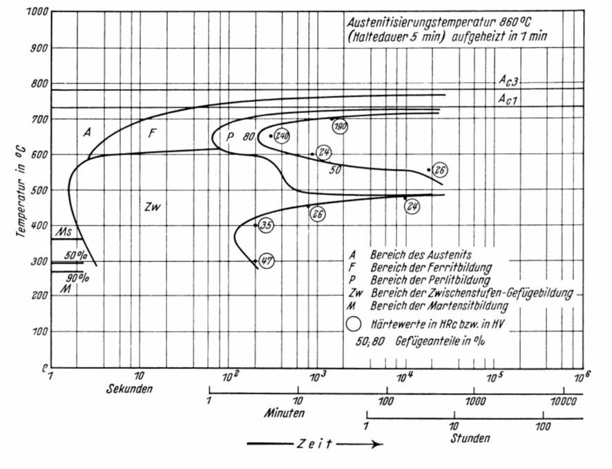

# Wärmebehandlung
Entnommen aus dem Skript von Prof. Dr.-Ing. Jürgen Häberle.

Prinzipiell können die Wärmebehandlungsverfahren nach der Art des Abkühlens in zwei Gruppen unterteil werden:

1. Glühverfahren
2. Härteverfahren

Grundsätzlich sind diese Verfahren für viele Materialien einsetzbar. Exemplarisch, da am weitesten verbreitet, werden die Wärmebehandlungen am Beispiel des [Eisen Kohlenstoff Diagramm](@ref "Eisen Kohlenstoff Diagramm") erklärt.

Glühen ist das Erwärmen eines Werkstücks auf eine bestimmte Temperatur mit nachfolgendem, in der Regel langsamen Abkühlen, so dass der Werkstoffzustand bei Raumtemperatur dem Gleichgewichtszustand nahe kommt. Die erreichbaren Eigenschaften ergeben sich aus den im [Eisen Kohlenstoff Diagramm](@ref "Eisen Kohlenstoff Diagramm") auftretenden Gefügearten.

Bei der zweiten Gruppe, den Härteverfahren, erfolgt das Abkühlen von einer Temperatur oberhalb der Umwandlungslinie ($\alpha$ / $\gamma$ - Umwandlungslinie) mit einer Geschwindigkeit, die größer ist als die kritische („Abschrecken“), um durch Umwandlung des Austenits in Martensit (gegebenenfalls auch Bai-nit) ein Gefüge zu erhalten, das einem Ungleichgewichtszustand entspricht ([ZTU-Diagramme](@ref "ZTU-Schaubilder")).

Beispiel: [Korngrenzenhärtung](https://youtube.com/watch?v=0BMYkE60cXo&si=EDhWBci0odIYmIIk)

## Begriffe und Definitionen

Die Wärmebehandlung ist eine Folge von Behandlungsschritten, in deren Verlauf ein Werkstoff ganz oder teilweise bestimmten Zeit-Temperatur-Folgen unterworfen wird, um eine Änderung seines Gefüges und damit seiner Verarbeitungs- und Gebrauchseigenschaften herbeizuführen. Die Behandlung kann mit einer Änderung der chemischen Zusammensetzung ($\rightarrow$ thermochemische Behandlung) oder auch einem Umformen ($\rightarrow$ thermomechanische Behandlung) verbunden sein.

Entsprechen dem Ziel des Verfahrens wird die Wärmebehandlung durch folgende Angaben charakterisiert:
- Art des Erwärmens
- Haltetemperatur
- Haltedauer
- Art des Abkühlens (Ofen-, Luft-, Öl-, Wasserabkühlung)

Ziel einer Wärmebehandlung kann beispielsweise sein:

- Verbesserung der Bearbeitbarkeit (Weichglühen)
- Arbeitsgang der Erzeugung (Härten von Werkzeugen)
- Verbesserung der mechanischen Eigenschaften (Vergüten von Stahl, Aushärten von Al-Legierungen)
- Verminderung des Verschleißes (Randschichthärten von Zahnrädern)
- Beseitigung von Kaltverfestigung (Rekristallisationsglühen)
- Abbau von Guss- oder Schweißspannungen (Spannungsarmglühen)

---

## Glühverfahren
**Spannungsarmglühen**

Verfahrensparameter:
- Langsames Erwärmen auf 550 - 650 °C (unterhalb Ac1)
- Haltedauer 2 - 4 h, langsame Abkühlung (Ofenabkühlung)

Ziel:     
    
Abbau innerer Spannungen (Eigenspannungen) ohne wesentliche Änderung der sonstigen Eigenschaften

**Rekristallisationsglühen** 

Verfahrensparameter:
- Rekristallisationstemperatur bei Stahl: 500 - 600°C
- halten, langsame Abkühlung
- bei zu langer Haltezeit: Grobkornbildung

Ziel:

Rückgängigmachen von Eigenschaftsänderungen (Verfestigung) durch Kaltumformung; Gefügeumbildung bzw. -neubildung im festen Zustand; Spannungsabbau, Erhöhung der Bruchdehnung

**Weichglühen**

Verfahrensparameter:
- Temperaturen um $\text{A}_{C1}$ (unterhalb, oberhalb oder pendelnd um $\text{A}_{C1}$)
- langsame Abkühlung.

Ziel:

Herstellung eines - für die Weiterverarbeitung günstigen - weichen Zustands. Dabei werden Zementitteilchen kugelig eingeformt (GKZ-Glühen).

**Normalglühen**

Verfahrensparameter:
- Temperatur 30 - 50°C über Umwandlungstempertur im Austenitgebiet. 
- Erwärmung zwischen $\text{A}_{C1}$ und Glühtemperatur rasch, kurze Haltedauer
- rasche Abkühlung durch Zweiphasen-Intervall, dann langsam abkühlen

Ziel:

Herstellung eines gleichmäßigen und feinkörnigen Gefüges mit Perlitanteilen, Annäherung an den Gleichgewichtszustand durch zweifaches Umkörnen (bei Erwärmung und Abkühlung). Häufig eingesetztes Verfahren

**Grobkornglühen**

Verfahrensparameter:
- Temperatur deutlich über $\text{A}_{C3}$ (950 - 1100°C)
- Haltezeit 1 bis 2 h
- langsame Ofenabkühlung
- dann raschere Luftabkühlung

Ziel:

Erzielung eines groben Korns. Hierdurch wird die Spanbarkeit verbessert.

**Diffusionsglühen**

Verfahrensparameter:
- Temperatur hoch im Austenitbereich
- lange Haltezeit (bis 50 h)
- langsame Abkühlung

Ziel:

Beseitigung örtlicher Konzentrationsunterschiede (Seigerungen) durch Diffusion.

## ZTU-Schaubilder
Das Umwandlungsverhalten aus dem Austenit ist für das Verständnis der Wärmebehandlung der Eisenwerkstoffe besonders wichtig. Je nach Abkühlungsgeschwindigkeit wird die Austenitum-wandlung zu tieferen Temperaturen verschoben (Bereich „A“ in Bild 4.3-1 b) und es werden drei Bereiche der $\gamma$-$\alpha$-Umwandlung unterschieden: Perlitstufe, Zwischenstufe, Martensitstufe

Der Gleichgewichtszustand des EKD wird bei Wärmebehandlungsverfahren mit beschleunigter Abkühlung nicht mehr eingehalten. Das Umwandlungsverhalten des Austenits bei einer Tempera-turführung je nach Wärmebehandlungsverfahren und einer Gefüge verändernden Beeinflussung durch Legierungselemente ist den  Zeit-Temperatur-Umwandlungs-Schaubildern (ZTU-Schau-bildern) der Stähle zu entnehmen. ZTU-Schaubilder stellen sozusagen eine Erweiterung des Eisen-Kohlenstoff-Diagramms in die dritte Dimension, die Zeit, dar. 

Das Aufstellen der ZTU-Schaubilder erfolgt mittels dilatometrischen und metallographischen Untersuchungen. Diese ZTU-Schaubilder sind eine der Grundlagen für die Erstellung von Anweisun-gen zur praktischen Durchführung der Wärmebehandlung. Dabei wird die Umwandlung zum Einen bei konstanter Temperatur (ZTU - Schaubild für isotherme Umwandlung) und zum Anderen bei kontinuierlicher Abkühlung (ZTU - Schaubild für kontinuierliche Abkühlung) betrachtet. Diese Diagramme geben Auskunft über Beginn und Ende der Umwandlung des jeweiligen Gefüges in Abhängigkeit von Temperatur und Zeit. 
Beim isothermen ZTU-Schaubild wird die Probe von der Austenitisierungstemperatur auf die gewünschte Temperatur abgeschreckt, und diese solange gehalten (Ölbad) bis die Umwandlung abgeschlossen ist.
Beim kontinuierlichen ZTU-Schaubild wird ausgehend von der Austenitiseriungsbedingung ver-schieden schnell abgekühlt, wodurch die Umwandlung in Ferrit, Perlit, Bainit (Zwischenstufe) oder Martensit bei verschiedenen Temperaturen in unterschiedlichem Ausmaß stattfindet. Am Ende der Abkühlkurve wird meist die erreichbare Härte eingetragen.
Für zahlreiche Stähle sind die Zeit- Temperatur- Umwandlungs- Schaubilder- (kontinuierlich und isotherm) im Atlas für Wärmebehandlung zu finden. Je ein Beispiel für den Vergütungsstahl 42CrMo4 ist im Bild dargestellt.
Für eine isotherme Abkühlung

und eine kontinuierliche.

 
## Härteverfahren
## Härten nach Volumenerwärmung
Voraussetzung für die Härtbarkeit eines Stahles ohne jegliche Vorbehandlung ist ein Kohlen-stoffgehalt von mindestens 0,3%. Bei Werkstücken mit kleinen Abmessungen kann eine vollstän-dige Martensitbildung über den gesamten Querschnitt erfolgen (Durchhärtung). Bei großen Ab-messungen wird die kritische Abkühlgeschwindigkeit nur bis zu einer bestimmten Tiefe erreicht (Einhärtung). Die Einhärtungstiefe ist abhängig von:

-	dem Querschnitt des Werkstückes
-	der kritischen Abkühlgeschwindigkeit des Werkstoffes (beeinflussbar durch
 Legierungselemente)
	dem Kühlvermögen des Abkühlmittels

Die erreichbare Höchsthärte ist allein vom Kohlenstoffgehalt abhängig, der zum Zeitpunkt des Ab-schreckens im Austenit gelöst war. Die Legierungselemente beeinflussen nur die Durchhärtung. Die maximal erreichbare Härte bei 100%iger Umwandlung zum Martensit liegt bei ca. 66 HRC (Rockwell-C Härteeinheiten) und wird bei ungefähr 0,8% des im γ-Mischkristall gelösten Kohlen-stoffes erreicht.

## Anlassen
Der beim Härten mit der Martensitbildung bewusst realisierte Ungleichgewichtszustand soll durch Erwärmen unterhalb Ac1, auch als Anlassen bezeichnet, in einen dem Gleichgewicht näheren Zu-stand überführt werden. Wegen der großen Härte und Sprödigkeit des Martensits werden die tech-nischen Gebrauchseigenschaften eines Stahles erst durch Anlassen erreicht.
Die sich einstellenden Gefügeänderungen sind abhängig von den Anlasstemperaturen und Anlass-zeiten, wobei im Stahl vorhandene Legierungselemente die Anlassstufen zu höheren Temperaturen verschieben.

1. Anlassstufe: 80 - 150° C
Verringerung der tetragonalen Verzerrung durch Diffusion der auf Zwischengitterplätzen zwangsgelösten Kohlenstoffatome → Bildung des kubischen Martensits und ε- (Ungleichgewichts-) Carbids (Volumenverringerung)

2. Anlassstufe: 130 - 290°C
Umwandlung des Restaustenits in kubischen Martensit 
(Volumenzunahme)

3. Anlassstufe: 250 - 400°C
Ausscheiden des gesamten Kohlenstoffs und Bildung von Zementit
(Volumenverringerung)

## Vergüten
Vergüten ist die unmittelbare Verbindung der Verfahren Härten und nachfolgendem Anlassen, und zwar bei höheren Temperaturen (350 – 700°C), zur Erzielung hoher Zähigkeit bei entspre-chender Festigkeit. Es wird angewendet bei Stählen mit 0,2 – 0,6% Kohlenstoff (Vergütungsstäh-le). Durch eine Gefügeverfeinerung hinsichtlich der Korn- und Karbidgröße sowie der Karbidver-teilung werden beim Vergüten die genannten mechanischen Eigenschaften erreicht.
Die erreichbaren Verbesserungen der mechanischen Eigenschaften sind querschnittsabhängig. Eine Durchvergütung größerer Querschnitte ist nur bei legierten Stählen möglich. Gegenüber dem nor-malisierten Zustand wird durch Vergüten eine erhebliche Zunahme der Festigkeit bei geringer Ab-nahme der Zähigkeitseigenschaften erreicht.

## Randschichthärten
Randschichthärten wird angewendet bei niedrig- und unlegierten Stählen mit 0,3 - 0,7% Kohlen-stoff (obere Grenze zur Vermeidung von Härterissen), insbesondere bei Kurbelwellen, Zapfen, Walzen, Zahnrädern u.a..
Ziel dieses Verfahrens ist eine harte und verschleißbeständige Oberfläche bei zähem Kern. Dazu wird die Randschicht des Werkstückes auf Härtetemperatur erhitzt und durch Abschrecken gehär-tet.
Das Randschichthärten ist mit folgenden Verfahren möglich:

- Flammhärten
- Induktionshärten
- Strahlhärten (Elektronenstrahl- und Laserhärten)
- Tauchhärten (für Teile mit mehrfach gekrümmten Oberflächen, bei denen o.g. Verfahren zu aufwendig sind)

## Thermochemische Verfahren
Bei den thermochemischen Verfahren wird die Randschicht von Werkstücken durch Eindiffundie-ren  chemischer Elemente in ihrer Zusammensetzung geändert, um bessere Verschleiß-, Korrosi-ons- und/oder Festigkeitseigenschaften zu erreichen. Als wichtigste Elemente sind Kohlenstoff, Stickstoff und Bor zu nennen, aber auch Metalle wie Zink, Chrom, Aluminium, Silizium u.a. wer-den benutzt.

## Aufkohlen / Einsatzhärten
Aufkohlen ist das thermochemische Behandeln von Werkstücken im austenitischen Zustand zum Anreichern der Randschicht mit Kohlenstoff, der im Austenit in fester Lösung (Einlagerungs-mischkristall) vorliegt. Die aufgekohlten Werkstücke werden anschließend unmittelbar oder nach Wiedererwärmen gehärtet (s. Bild 4.5-1). Die Kombination Aufkohlen und Härten wird als Ein-satzhärten bezeichnet und bei Stählen mit niedrigem Kohlenstoffgehalt von 0,2% (Einsatzstähle) angewendet:

1. Aufkohlen (Einsetzen, Zementieren) der Randschicht durch langzeitiges    Halten über $\text{A}_{c3}$  (850- 930°C) als
    -	Gasaufkohlen in CO-, CH4-haltigen Gasen
    -	Badaufkohlen in cyanathaltigen Salzschmelzen
2.	Härten der Werkstücke

Das Härten der aufgekohlten Bauteile kann je nach Werkstoff und Anforderung an das Bauteil so-wie dessen Form und Größe unterschiedlich erfolgen. Es ist dabei zu beachten, dass das Werkstück eigentlich aus zwei Werkstoffen besteht:

1.	einer kohlenstoffreichen Randschicht  (~ 0,8% Kohlenstoff)
2.	einem kohlenstoffarmen Kern (~ 0,2% Kohlenstoff)

 
Die wichtigsten Verfahren sind:
-	Direkthärten (Härten von Aufkohlungstemperatur)
Nach dem Bad- bzw. Gasaufkohlen bei geometrisch einfachen Teilen und geringer  
Aufkohlungs- bzw. Einsatzhärtungstiefe
-	Kern- bzw. Randhärten:
Nach dem Aufkohlen werden die Teile auf Raumtemperatur oder Zwischenglühtemperatur (500 - 650°C) abgekühlt. Die Härtung erfolgt von Austenitisierungs-Temperaturen, die den Kohlenstoffgehalten der Kern- (KHT) oder der Randzone (RHT) entsprechen (Bild 4.5-1)

## Nitrieren
Beim Nitrieren erfolgt das Anreichern der Randschichten eines Werkstoffes mit Stickstoff in ammoniakhaltigen Gasen oder in cyanathaltigen Salzbädern in einem Temperaturbereich von 480- 580°C. Hierbei ist das Ziel eine Erhöhung der Härte der Oberfläche von Werkstücken durch Bildung sehr harter Nitride. Für diese Behandlung sind Vergütungsstähle geeignet, die mit Nit-ridbildnern (Al, Cr, Mo und V) legiert sind.
Der Verschleißwiderstand und die hohe Dauerschwingfestigkeit nitrierter Bauteile bleibt bis 500 °C erhalten.

## Thermomechanische Verfahren
Bei der thermomechanischen Behandlung (TMB) wird das Warmumformen – vorwiegend das Walzen - unmittelbar mit dem Wärmebehandeln gekoppelt. Durch geeignete Abstimmung der chemischen Zusammensetzung der verwendeten Stähle sowie genauste Messung und Steuerung zahlreicher Walzparameter, z.B. Umformgrade, Erwärmtemperatur, Temperaturbereiche des Vor- und Fertigwalzens und Abkühlbedingungen werden Werkstoffeigenschaften erreicht, die durch eine Wärmebehandlung allein nicht zu realisieren sind. Auf diese Weise werden z.B. schweißgeeignete Feinkornbaustähle, Beton- und Spannbetonstähle u.a. hergestellt.
Entscheidende Voraussetzung für alle TMB- Verfahren ist eine hoch entwickelte Walzwerktechno-logie und Prozesskontrolle, da jede Abweichung von den Produktionsanweisungen zu unbrauchba-ren Erzeugnissen führt.

## Aushärten
Aushärten ist eine Wärmebehandlung bestehend aus Lösungsglühen und Auslagern, die vor allem für NE- Legierungen von erheblicher Bedeutung ist. Legierungen, die aushärtungsfähig sind, müs-sen folgende Voraussetzungen erfüllen:
1.	Die Legierung muss bei höheren Temperaturen teilweise aus homogenen Mischkristallen (einphasiger Bereich) bestehen.
2.	Bei langsamer Abkühlung müssen die Mischkristalle Segregate ausscheiden, d. h., abneh-mende Löslichkeit für eine Komponente existiert bei abnehmender Temperatur (zweiphasi-ger Bereich)
3.	Die homogenen Mischkristalle bei höheren Temperaturen müssen auch nach dem Abschre-cken in homogener, aber übersättigter Form bestehen bleiben.

Bei Legierungen, die diese Voraussetzungen erfüllen, erfolgt die Wärmebehandlung in drei Schrit-ten (Bild 4.7-1):

1. Lösungsglühen
Die Legierung wird auf Homogenisierungstemperatur erwärmt und so lange gehalten, bis alle Segregate im Mischkristall gelöst sind, es liegt Einphasigkeit vor.
2. Abschrecken
Das Abschrecken von der Homogenisierungstemperatur verhindert das Ausscheiden der Segregate. Es entsteht ein unterkühlter, homogener, aber übersättigter Mischkristall.
3. Auslagern
Das Auslagern bei legierungsspezifischen Temperaturen  (Kalt- oder Warmauslagern) führt zu ein- oder zweiphasigen Entmischungen, d.h. Ausscheidungen im submikroskopischen Bereich führen zur Festigkeitssteigerung.

Diese Ausscheidungen können als Guinier-Preston-Zonen, z.B. in einer Al-Cu-Legierung, oder als kohärente Ausscheidungen , z.B. in Al-Mg-Si- Legierungen, auftreten.
