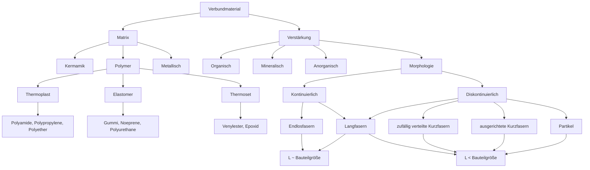

# Faserverbunde

Figure is based on this paper [Figure 2](https://doi.org/10.3390/jcs8040126).

```mermaid
graph TD;
    Verbundmaterial-->Matrix;
    Matrix-->Kermamik;
    Matrix-->Polymer;
    Matrix-->Metallisch;
    Polymer-->Thermoplast-->Thermoplast_Beispiel["Polyamide, Polypropylene, Polyether"];
    Polymer-->Elastomer-->Elastomer_Beispiel["Gummi, Noeprene, Polyurethane"];
    Polymer-->Thermoset-->Thermoset_Beispiel["Venylester, Epoxid"];
    Verbundmaterial-->Verstärkung;
    Verstärkung-->Organisch;
    Verstärkung-->Mineralisch;
    Verstärkung-->Anorganisch;
    Verstärkung-->Morphologie
    Morphologie-->Kontinuierlich;
    Kontinuierlich-->Endlosfasern;
    Kontinuierlich-->Langfasern;
    Endlosfasern-->Limit["L ~ Bauteilgröße"]
    Langfasern-->Limit["L ~ Bauteilgröße"]
    Diskontinuierlich-->Langfasern
    Morphologie-->Diskontinuierlich;
    Diskontinuierlich-->Kurzfasern_ramdom["zufällig verteilte Kurzfasern"];
    Diskontinuierlich-->Kurzfasern_aligned["ausgerichtete Kurzfasern"];
    Diskontinuierlich-->Partikel;
    Langfasern-->Limit_2["L < Bauteilgröße"];
    Kurzfasern_ramdom-->Limit_2["L < Bauteilgröße"];
    Kurzfasern_aligned-->Limit_2["L < Bauteilgröße"];
    Partikel-->Limit_2["L < Bauteilgröße"];
```
