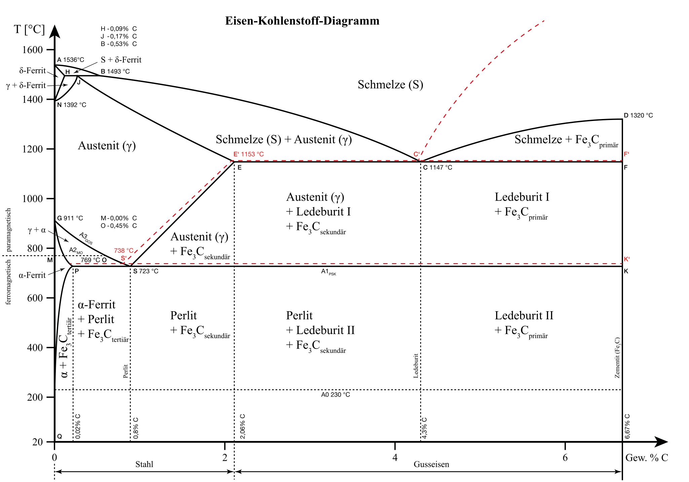

# Eisen-Kohlenstoff Diagramm
Phasendiagramme stellen dar, wie sich die Mikrostruktur eines Werkstoffs oder Werkstoffgemischs verhält. Am Beispiel des Eisen-Kohlenstoffdiagramm läss sich dies verdeutlichen. Links sehen wir das Verhalten von reinem Eisen. Hier kann man erkennen, dass Eisen von der Schmelze (oberer Rand) bis zu Raumtemperatur mehrere Kristallzustände durchläuft. Diese sind für den jeweiligen Temperaturbereich energetisch günstig.

| Name | Gitterstruktur |
|---|---|
|$\delta$ Ferrit (Delta-Ferrit)| kubisch raumzentrierte Kristallstruktur|
| $\gamma$ Mischkristalle (Austenit)| kubisch flächenzentrierte Kristallstruktur|
|$\alpha$ Ferrit (Alpha-Ferrit) | kubisch raumzentrierte Kristallstruktur|

Durch Zugabe weiterer Elemente (hier dargestellt Kohlenstoff) ergeben sich neue Grenzen dieser Kristalle. Die energetisch günstigen Zustände verschieben sich.

Zudem verändern sich die Eigenschaften deutlich. Es kommt in aller Regel zu Mischkritallen. Je nach Abkühlungsgeschwindigkeit und Zusammensetzung, können die Eigenschaften an spezifische Anforderungen angepasst werden [Wärmebehandlung](), [Legierungen]()

Hier kommt noch mehr