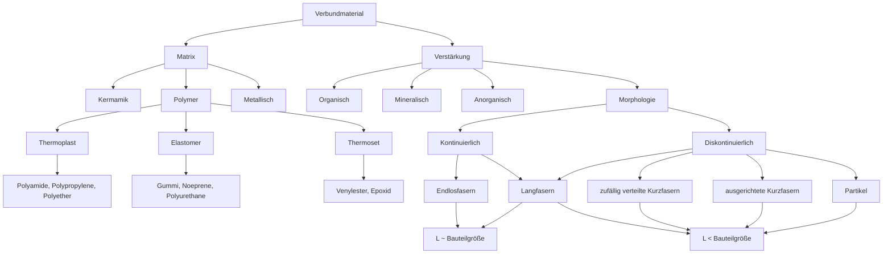
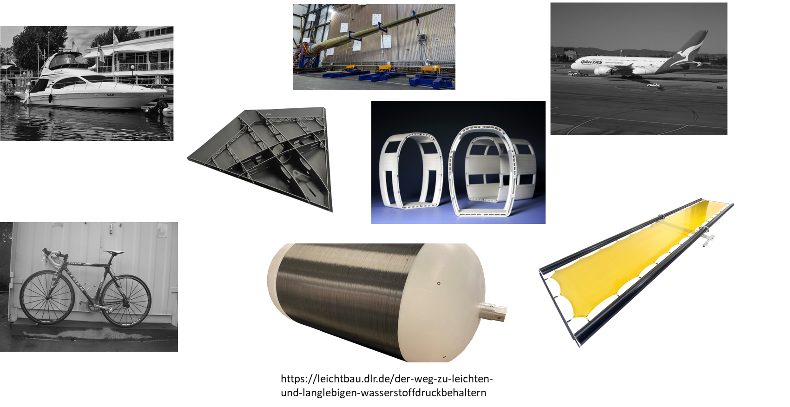
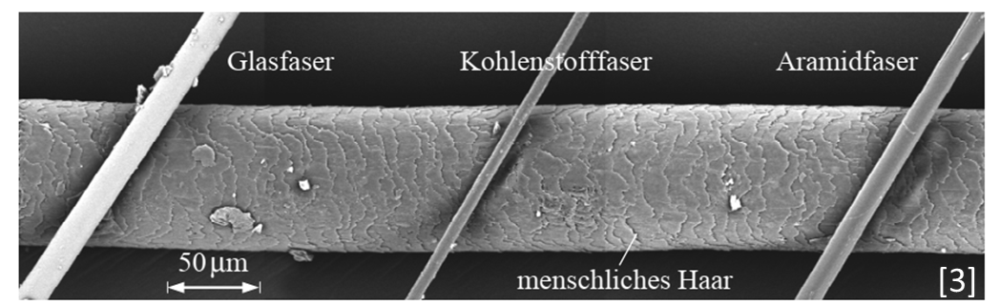

# Verbundwerkstoffe

Figure is based on this paper [Figure 2](https://doi.org/10.3390/jcs8040126).

## Anwendungen

| Gebiet  | Motivation | 
|---|---|
| Luft- und Raumfahrt  | Festigkeits/Steifigkeits – Gewichtsverhältnis, Schadens- und  Korrosionsstoleranz, Wartbarkeit / Reparierbarkeit | 
| Schifffahrt  | Salzwasser; Schlagschäden, Lange Lebendauer | 
| Bauwesen  | Widerstand gegen Umwelteinflüsse und Korrosion; Langlebigkeit | 
|Landtransportsysteme | Kosten, Einfache Fertigbarkeit | 

## Komponenten von Faserkunstoffverbunde 
**Matrix – bindende Komponente**
- Formgebend
- Schutz und Stabilisierung der Fasern
- Spannungen an die Fasern übertragen

**Faser – verstärkende Komponente**
- Lasttragend da hohe Steifigkeit und/oder - Festigkeit bei geringem Gewicht
- Begrenzte thermische Dehnung

**Weitere Bestandteile (optional)**
- Faserbeschichtungen
- Füllstoffe
- Beimischung anderer Fasertypen

## Ausgangswerkstoffe - Faser

- Kurzfasern
    - Wirre Anordnung (geringe Anistropie)
    - Oft recyclete Fasern
- Langfasern
    - Mehrere Millimeter Länge
    - Geringere Anforderung bei Verarbeitung und Lagerung
- Endlosfasern
    - Hohe Festigkeiten und Steifigkeiten
    - Höhere Anforderung bei Verarbeitung und Lagerung

- Naturfasern: Haare, Wolle, Seide, Baumwolle, Flachs, Sisal, Hanf, Jute, Ramie, Bananenfasern ...
- Organische Fasern: Polyethylen (PE), Polypropylen (PP), Polyamid (PA), Polyester (PES), Polyacrylnitril (PAN), Aramid, Kohlenstoff ...
- Anorganische Fasern: Glas, Basalt, Quarz, SiC, Al2O3, Bor, ...
Metallfasern aus: Stahl, Aluminium, Kupfer, Nickel, Beryllium, Wolfram ... 

## Koordinaten

## Eigenschaften

| Material | $E_{f,11}\,[N/mm^2]$ | $E_{m}\,[N/mm^2]$ | $E_{11}\,[N/mm^2]$ |
|---|---|---|---|
E-Glasfaser | 73000 | 3400 | 45160  | 
HT-C-Faser | 230000 | 3400 | 139960 |
HM-C-Faser | 392000 | 3400 | 236560 |
Aramamid   | 125000 |3400 | 76360 |
Stahl 25CrMo4 | | | 206000|
Aluminium-Legierung AlCuMg2 | | | 72400|
Titan-Legierung | | | 108000|

## Faservolumenanteil
$\rho = \phi\rho_f+(1-\phi)\rho_m$