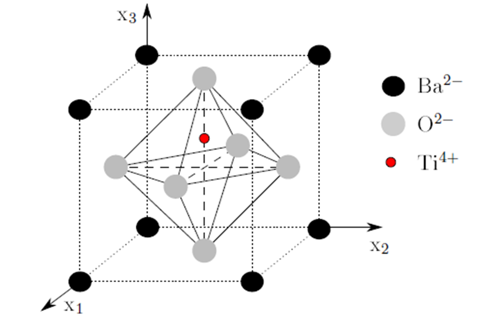
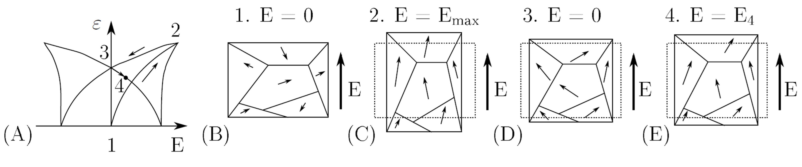
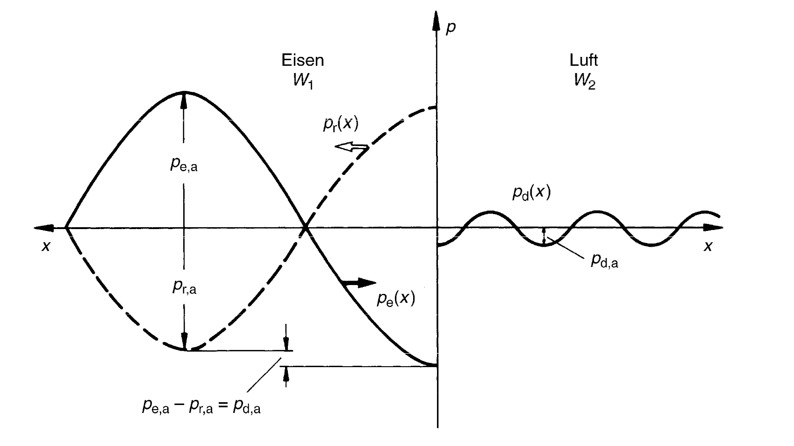

# Zerstörungsfreie Prüfverfahren (ZfP)

ZfP 1.0 – Werkzeuge (zur Schärfung der Sinne)
ZfP 2.0 – Analoge Systeme (zur Ansicht innerhalb der Komponenten)
ZfP 3.0 – Digitale Verarbeitung und Automatisierung
ZfP 4.0 – Transparenz von Informationen, technische & digitale Hilfsmittel und autonome und dezentralisierte Entscheidungen

|            | Fehler existiert | Fehler existiert nicht  | 
|------------|--------------------|-------------|
| Detektion           | True positive           | False positive |
| Keine Detektion     | False negative          | True negative  |

False negative bedeutet, dass ein Fehler existiert, aber nicht detektiert wird. Das kann zu Fehleinschätzung zum Zustand der Struktur führen. False positives sind Fehler die detektiert werden, aber nicht existieren oder nicht relevant sind. Dies kann ökonomisch ungünstig sein, wenn Reparaturen durchgeführt werden, welche nicht notwendig sind. Treten zu viele false positives auf, wird dem System kein Vertrauen geschenkt und dies kann auch zu Sicherheitsproblemen führen. 

True positves and Ture negatives sind die erwünschten Ergebnisse einer ZfP.

## Entwicklungsstufen

ZfP 1.0 – Werkzeuge (zur Schärfung der Sinne)
ZfP 2.0 – Analoge Systeme (zur Ansicht innerhalb der Komponenten)
ZfP 3.0 – Digitale Verarbeitung und Automatisierung
ZfP 4.0 – Transparenz von Informationen, technische & digitale Hilfsmittel und autonome und dezentralisierte Entscheidungen

## Probabilty of Detection

Ist eine Metrik, welche die Wahrscheinlichkeit der Detektion eines Fehlers einer bestimmten Größe angibt. Im Bild würde ein Fehler der Größe 22 mm mit 90% detektiert werden. 

Die zulässige Fehlergröße ist in aller Regel bekannt. D.h. die Auswahl eines Prüfverfahrens wird unter anderem durch die POD bestimmt.

Die Wahrscheinlichkeit wird in aller Regel mit einer Konfidenz von 95% angeben. D.h. zu 95% werden 90% der Fehler detektiert.

## Schadensgröße

- je nach Verfahren variiert die detektierbare Schadensgröße
- es gilt nicht immer _kleine Schadesgröße_ $=$ _besser_
- minimaler Schaden $l = \frac{\lambda}{2}$ -> Abstasttheorem
$c = \lambda f$
- $c$ ist die Licht- oder Schallgeschwindigkeit

$\lambda = \frac{c}{f} = \frac{6000 m/s}{10^6 1/s} = 6 mm$

## Verfahrensübersicht

Tabelle übernommen aus [Wikipedia](https://de.wikipedia.org/wiki/Werkstoffpr%C3%BCfung#Zerst%C3%B6rungsfreie_Werkstoffpr%C3%BCfung)

| Prüfverfahren  | Dynamisch/ Statisch | Anregung           | Prüfbereich |
|---|---|---|---|
| Akustische Resonanzanalyse                | Dynamisch           | Mechanisch         | Volumen     |
| Bewehrungsortung (induktiv)               | Statisch            | Magnetisch         | Volumen     |
| Bewehrungsortung (kapazitiv)              | Statisch            | Elektrisch         | Volumen     |
| Bodenradar                                | Dynamisch           | Elektromagnetisch  | Volumen     |
| Dehnungsmessstreifen-Prüfung              | Dynamisch           | Mechanisch         | Oberfläche  |
| Durchstrahlungsprüfung                    | Dynamisch           | Elektromagnetisch  | Volumen     |
| Feuchtemessung (kapazitiv)                | Statisch            | Elektrisch         | Oberfläche  |
| Feuchtemessung (resistiv)                 | Statisch            | Elektrisch         | Oberfläche  |
| Impakt-Echo Verfahren                     | Dynamisch           | Mechanisch         | Volumen     |
| Potentialfeldmessung                      | Statisch            | Elektrochemisch    | Volumen     |
| Rückprallhammer                            | Dynamisch           | Mechanisch         | Oberfläche  |
| Dichtheitsprüfung                         | Statisch            | Chemisch           | System      |
| Eindringprüfung                           | Statisch            | Mechanisch         | Oberfläche  |
| Zeitbereichsreflektometrie                | Dynamisch           | Elektromagnetisch  | Volumen     |
| Infrarotthermografie                      | Dynamisch           | Thermisch          | Oberfläche  |
| Leitfähigkeitsprüfung                     | Elektrisch, Statisch| Thermisch          | Volumen     |
| Magnetinduktive Methode                   | Statisch            | Magnetisch         | Oberfläche  |
| Magnetpulverprüfung                       | Statisch            | Magnetisch         | Oberfläche  |
| Mikrowellenprüfung                        | Dynamisch           | Elektromagnetisch  | Volumen     |
| Prozesskompensierte Resonanzprüfung       |                     |                    |             |
| Reflexionsspektroskopie                   | Statisch            | Elektromagnetisch  | Oberfläche  |
| Röntgenfluoreszenzanalyse                 | Statisch            | Elektromagnetisch  | Oberfläche  |
| Schallemissionsanalyse                    | Dynamisch           | Mechanisch         | Volumen     |
| Shearografie                              | Dynamisch           | Optisch            | Oberfläche  |
| Visuelle Inspektion                       |                     | Optisch            | Oberfläche  |
| Streufeldmessung                          | Statisch            | Magnetisch         | Volumen     |
| Ultraschallprüfung                        | Dynamisch           | Mechanisch         | Volumen     |
| Vibrationsprüfung/Schwingungsanalyse      | Dynamisch           | Mechanisch         | System      |
| Wirbelstromprüfung                        | Statisch            | Elektrisch         | Oberfläche  |

## Visuelle Inspektion (Sichtprüfung)

## Eindringprüfung
Die Eindringprüfung ist auf allen Werkstoffen anwendbar, die eine eindeutige Anzeige von Oberflächenfehlern erlauben und nicht porös sind. Vorwiegend sind das Metalle, Kunststoffe (mit Einschränkungen, z. B. Teflon), glasierte Keramiken und ähnliches. Bei Maschinenteilen aus Stahl wird wegen der hohen Korrosionsanfälligkeit gegen Wasser in der Regel ein Entwickler auf Lösemittelbasis verwendet bzw. bei ferromagnetischen (nicht austenitischen) Stählen gleich die [Magnetpulverprüfung](https://de.wikipedia.org/wiki/Magnetpulverpr%C3%BCfung) angewandt.

1. Reinigung, 2. Farbe auftragen und eindringen lassen, 3. Oberflächliches reinigen, 4. Entwickler auftragen

Kann bei Tageslicht oder im dunkeln durchgeführt (Fluoreszierende Eindringprüfung) werden. Farbe variiert bedarfsabhängig.

# Verfahren

## Sichtprüfung

- kann mit verschiedenen Werkzeugen stattfinden und ist sehr verbreitet
- direkte Sichtprüfung
  - Auge
  - Boroskope (Elastoskope, Endoskope, Spiegelrohre, ...)
- indirekte Sichtprüfung
  - Kameras
  - Drohnen

## Eindringprüfung

1. Reinigung, 2. Farbe auftragen und eindringen lassen, 3. Oberflächliches reinigen, 4. Entwickler auftragen

- bei Tageslicht oder im dunkeln 

## Durchstrahlungsprüfung

- Röntgen-, Mikrowellen-, Gammastrahlung 
- Synchrotronstrahlung (Spezialfälle, eher selten)

- auch als Computertomographie nutzbar

## Thermographie
**aktive**
- Bauteil ist warm und wird vermessen
- Unterschiede in der Temperaturverteilung können zur Identifikation von Fehlern genutzt werden
- Prozessanpassungen sind möglich

**passive**
- Bauteil wird angeregt und die Reaktion wird vermessen
- induktive Erwärmung bei Kohlefaserverbundbauteilen

## Modalanalyse

$\mathbf{M}\ddot{\mathbf{u}}+\mathbf{Ku}=\mathbf{0}$

- Eigenformen
- Eigenfrequenzen

$(\mathbf{K}-\omega^2\mathbf{M})\hat{\mathbf{x}}=\mathbf{0}$

**Federpendel**
$m\ddot{u}+cu=0$

$c-\omega^2 m = 0$

$\omega = 2\pi f = \sqrt{\frac{c}{m}}$

- Anregung mit einem Shaker oder Impulshammer
- Messpunkte mit Beschleunigungssensor oder Laser
- Ein Anregungspunkt -> viele Messpunkte
- Viele Anregungspunkte -> ein Messpunkt

## Ultraschallprüfung

**Wellenarten**
Longtitudinalwellen (P Wellen)
Transversalwellen (S Wellen)
Love Wellen
Rayleighwellen
Lambwellen, bzw. geführte Ultraschallwellen
Symmetrische, unsymmetrische und Schubwellen
Torsionswellen
Schubwellen

---

## Schallgeschwindigkeiten
$c_{l}=\sqrt{\frac{E(1-\nu)}{\rho(1-\nu-\nu^2)}}$
$c_{t}= \sqrt{\frac{G}{\rho}}$

Geführte Ultraschallwellen sind dispersiv
sie haben eine Gruppen und Phasengeschwindigkeit

## Dispersion

- Gruppengeschwindigkeit - wie schnell bewegt sich die Hüllkurve 
- Phasengeschwindigkeit - wie schnell bewegt sich die Phase (einzelne Frequenz)

- für eine Frequenz sind Gruppen und Phasengeschwindigkeiten identisch

- Für frequenzabhänige Phasengeschwindigkeiten verbreitert sich die Hüllkurve -> Dispersion 

## Piezoelektrischer Effekt

- Aktuatoreffekt
- Sensoreffekt
- $d_{31}$; el. Spannung in 3 Richtung und Deformation in 1, bzw. 2 Richtung
- $d_{33}$; el. Spannung in 3 Richtung und Deformation in 3 Richtung

---

## Reflexionen an Grenzflächen
- Schallwiderstand $W = c_L\rho$

_Reflektierender Schall_
$\frac{p_{a,r}}{p_{a,e}}=\frac{W_2-W_1}{W_2+W_1}$

_Durchgehender Schall_
$\frac{p_{a,d}}{p_{a,e}}=\frac{2W_2}{W_2+W_1}$

## Signal - Rausch Verhältnis

$SNR = \frac{P_{Signal}}{P_{Rauschen}}$

- Mehrfachmessungen reduziert den Rauschanteil

## Messaufbau

- 1 - 2 Wandler
- Messverstärker
- Messaufnehmer

## Anbindung des Prüfkopfs an die Oberfläche

Wasser
- billig
- gut automatisierbar

Motoröl, Schmierfett
- bereits vorhanden im Bauteil
- nicht optimiert auf Prüfung

Glycerin, Gel
- Vorteilhaft ist die hohe Viskosität und die hohe akustische Impedanz
- raue Oberflächen und stark dämpfende Materialien (Schweißnahtprüfung)

Luft
- spart Koppelmedium
- viel Rauschen

## Impuls-Echo Verfahren

- Zone des "Todes"
  - Zeit für Wechsel von Sender zum Empfänger

- Doppelsensorsystem
  - Messung auf beiden Seiten
  - Zugänglichkeit und Aufwand

## Schweißnahtprüfung

- Schrägschallung aufgrund der schwierigen Ankopplung

## Klebschichten

- werden ähnlich geprüft
- es kann sogenannte "kissing bonds" geben

## Wanddickenmessung

## Bildgebung

- Messdaten können auf verschiedene Weise dargestellt werden

## A Bild (amplitude)

- Laufzeit vs. Amplitude
- bei konstanter Geschwindigkeit kann für einen Punkt eine Fehlstelle im Signal detektiert werden

## B Bild (brightness)

- Einzelpunkt ist nur eine andere Darstellung des A Bildes (Intensität des Echos wird durch Helligkeit dargestellt)
- Durch die Erfassung der Schallrichtung können 2D oder 3D Bilder erzeugt werden

## C Bild
- ein projiziertes Bild der Größen der Fehlstellen

## D Bild

- flächiger Scan

## Dickenmessung mittels Geführten Ultraschallwellen

## Mikroskopie

- Analyse der Mirkostruktur von Werkstoffen
- Lokale Analyse der Werkstoff- oder Kornzusammensetzung
- Präparation der Probe (Schleifen, Oberflächenbehandlung, usw.)
- Lichquellen beeinflusssen maßgeblich den Kontrast
- Filter

---

## Lichtmikroskopie

- Korngrößenanalyse von Metallen und Legierungen 
- Flächenzählverfahren 
- Linienschnittverfahren (Korngrenzenschnitte mit durch den Prüfer in das Bild definierten Linienzug)

---

## Elektronenrastermikroskop
- nutzt Elektronenstrahlen zum Abtasten
- Auflösung hierdurch deutlich erhöht $1nm .. 2nm$
- ca. 500 mal bessere Vergrößerung als beim Lichmikroskop (2000:1) vs. (1000000)

---

## Rastersondenmikroskopie

- Abstasten der Struktur mit einer Nadel
- Wechselwirkung ist nicht mechanisch und unterscheidet sich je nach Mikroskop
  - Tunnelstrom
  - Van der Waals Kräfte (korreliert mit Federsteifigkeit)
  - magnetische Kräfte

---

