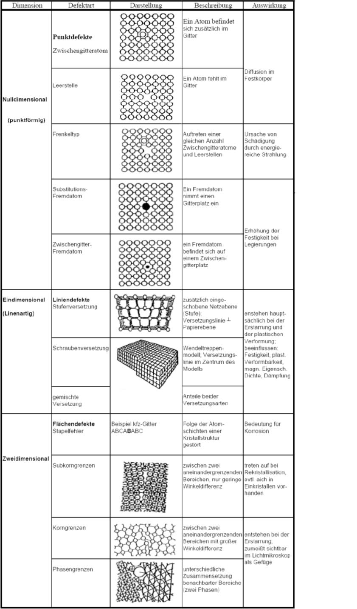

# Gitterbaudefekte

-	Nulldimensionale Fehlstellen (Punktdefekte): Leerstellen, Zwischengitteratom, Zwischengitter-Fremdatome, Substitutions-Fremdatom
-	Eindimensionale Fehlstellen (Liniendefekte): Versetzungen
-	Zweidimensionale Fehlstellen (Flächendefekte): Stapelfehler, Korngrenzen, Subkorn-grenzen, Phasengrenzen

Bild entnommen aus den Skript von Prof. Dr.-Ing. Häberle.

# Einfluss des Raumgitters auf Werkstoffeigenschaften

- Korrosion: Angriff aggressiver Medien erfolgt an bevorzugten Ebenen
- Verformung: Plastische Verformung erfolgt entlang bevorzugter kristallografischer Ebenen und Richtungen → Gleitsysteme
- Ultraschall: Verwendung von Schwingquarzen mit speziellen kristallografischen Begrenzungsflächen
- Leitfähigkeit:	Verwendung von Germanium- oder Silizium-Wafern in (1 1 1)- oder (1 0 0) - Orientierung für Halbleiterelemente
- Magnetisierung: leichteste Magnetisierung von Eisen-Silizium-Transformatorenblechen entlang der Würfelkante [1 0 0]
