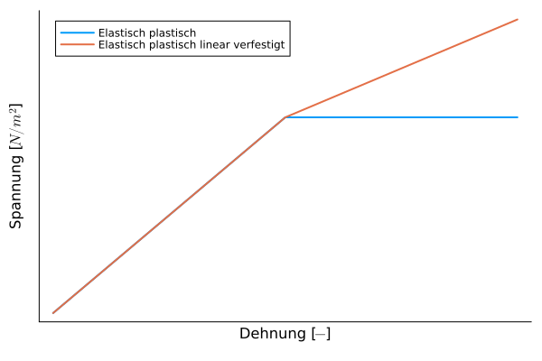

# Plastizität
Beschreibt die Fähigkeit von Feststoffen, sich unter einer Krafteinwirkung nach Überschreiten einer Elastizitätsgrenze irreversibel zu verformen bzw. umzuformen (zu fließen) und diese Form nach der Einwirkung beizubehalten. Wichtige Kenngrößen sind die [Streckgrenze](@ref "Festigkeit und Streckgrenze").

**Hohe Plastizität**
- Knete
- feuchter Ton
- Metalle und Metalllegierungen mit geeignetem Atomgitter:
  - glühender Stahl beim Schmieden
  - Kaltumformung von Blechen 

**Geringe Plastizität**
  - Gummi
  - Keramik
  - Faserkunstoffverbunde (Epoxid-Glasfaser oder Epoxid-Kohlefaser)
   
## Plastizität im Einkristall

Die plastische Verformung eines Kristalls vollzieht sich  im Wesentlichen durch Abgleiten von Atomschichten entlang bestimmter kristallographischer Ebenen und Richtungen unter Einwirken von Schubspannungen.

- Gleitsystem besteht aus Gleitebene und Gleitrichtung
- kritische Schubspannung ($\tau_{Kr}\approx G/10$ - Abschätzung oder theoretische Schubfestigkeit)
- Realtität um Faktor ~100 niedriger durch Versetzungen

Das Bild zeigt wie sich die Versetzungzone durch den Kristall bewegt.

  
## Plastische Verformung des polykristallinen Werkstoffs

- Mikro- und Makroplastizität
  - Plastische Verformung beginnt bei "ungünstigen" Orientierungen
- Korngrenzen
  - Barriere für Versetzungsbewegung
  - bei hohen Temperaturen können Korngrenzen gleiten (Kriechen)
  - gezielte Fertigung kann durch Korngrenzen Zähigkeit erhöhen
- Heterogenität
  - Mehrphasigkeit
  - inhomogene Verteilung der Spannungen und Verformungen
- Anisotropie

## Modellierung
Die Modellierung von plastischem Verhalten ist sehr komplex. Das simpelste Modell ist ein elasto-plastisches Modell. Dort steigt die Spannung bis zu einer Streckgrenze (Fließspannung) und bleibt ab dort konstant. Komplexere Modelle gehen dann von einfachen linearen Zusammenhängen aus, bei denen die Spannungen weiterhin linear steigen, aber mit einem geringeren Gradienten.

[Beispiel aus einer Simulation](https://www.youtube.com/watch?v=mWanREXKLO4)

## Technische Bedeutung
Die Plastizität beeinflusst die Möglichkeit einem Werkstoff umzuformen maßgeblich. Man kann zwischen Duktilität (Zug) und Schmiedbarkeit (Druck) unterscheiden.

!!! info "Duktilität"
    Bei Tiefziehprozessen ist eine hohe Duktilität des Werkstoffs von Vorteil.