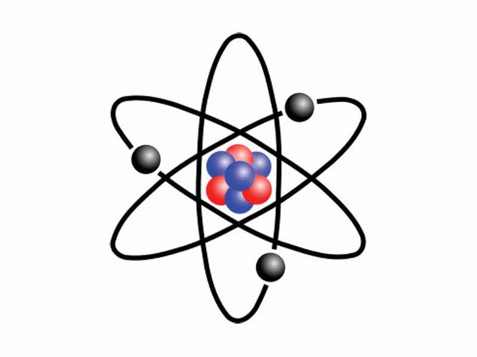
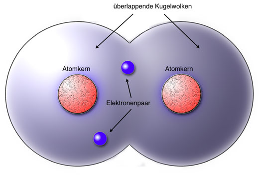

# Struktur von Werkstoffen
Werkstoffstrukturen sind unterteilbar in ihre
- Atomistische Struktur (Art der atomaren Bausteine)
- Feinstruktur (Bindungen zwischen den atomaren Bausteinen und deren geometrische Anordnung)
- Mikrostruktur (Gefüge – Bereiche geometrischer Anordnung, die im Werkstoffinnern durch Grenzflächen voneinander getrennt sind)
- Makrostruktur (Grobstruktur – Gesamterscheinung eines Werkstoffes bei der Herstellung und dem Einsatz eines Bauteils)

**Atomistische Struktur**

_Atomarer Baustein mit Atomkern und –hülle_

_Molekül (Atombindung)_

**Feinstruktur**

## Einheitszelle

| Kristallsystem   | Gitterkonstanten | Achswinkel | Beispiele |
|---|---|---|---|
| triklin          | a0 ≠ b0 ≠ c0      | α ≠ β ≠ γ ≠ 90°            | Silikat-Minerale             |
| monoklin         | a0 ≠ b0 ≠ c0      | α = γ = 90°; β ≠ 90°       | Mo2S3; β-Pu                  |
| (ortho)rhombisch | a0 ≠ b0 ≠ c0      | α = β = γ = 90°             | U, S, P, Ga, γ-Sn           |
| rhomboedrisch    | a0 = b0 = c0       | α = β = γ ≠ 90°            | As, Hg, Sb                   |
| hexagonal        | a0 = b0 ≠ c0       | α = β = 90°; γ = 120°      | α-Ti, Mg, Zn                 |
| tetragonal       | a0 = b0 ≠ c0       | α = β = γ = 90°            | B, CuTi3, Sn (T>13,5°)      |
| kubisch          | a0 = b0 = c0       | α = β = γ = 90°            | Cu, Al, Ni, Au, Ag; γ-Eisen (kfz); α-Eisen, V, Cr, W (krz); Mn, Po (kp) |

---

**Zahl der Atome pro Elementarzelle (EZ)** Diese kann sich deutlich unterscheiden, siehe kubisch raumzentriert oder kubisch flächenzentriertes Gitter.

**Koordinationszahl** beschreibt die Zahl der Atome, die sich im kürzesten und gleichen Abstand von einem wählbaren Zentralatom befinden.

**Packungsdichte** beschreibt, inwieweit eine Elementarzelle tatsächlich mit dem Volumen der Atome ausgefüllt ist. Sie ist das Volumen der Atomsegmente in der Elementarzelle bezogen auf das Volumen der Elementarzelle selbst.

## Häufigste Gitterformen bei Metallen

kfz

krz

hdp (hexagonal dichteste Packung) ->bilder

**Mirkostruktur**

**Makrostruktur**